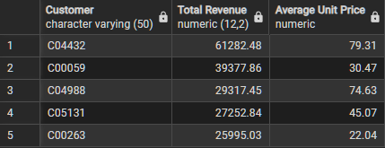
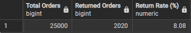
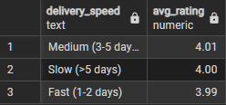
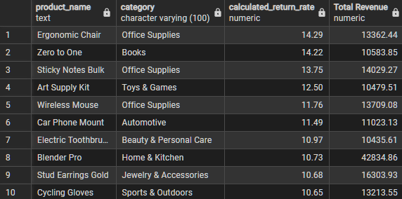

# E-Commerce SQL Performance Analysis
Project Overview
This project is a deep dive into e-commerce data using PostgreSQL. I focused on answering key business questions about customer loyalty, shipping efficiency, and product quality to help a retail business make better, data-driven decisions.

# Tools Used
Database: PostgreSQL

Interface: pgAdmin 4

# Key Business Insights
1. VIP Customer Identification
Goal: Find our most valuable customers and see if they buy premium or budget items.

Insight: Our top customer (C04432) is a major "Whale," spending over $61,000. Most top spenders prefer premium items with an average price of $70+.

# Global Return Rate Check
Goal: Understand the overall health of the business regarding returns.

Insight: The business has an 8.08% return rate. Out of 25,000 orders, 2,020 were returned. This is a healthy baseline for e-commerce.

# Logistics: Does Speed Affect Ratings?
Goal: See if slow delivery makes customers unhappy.

Insight: Interestingly, in this dataset, the average rating stays very stable (around 4.0) regardless of delivery speed. Customers are just as happy with "Medium" delivery as with "Fast" delivery.

# High-Return Products
Goal: Identify popular products that are returned too often.

Insight: The Ergonomic Chair , "Zero to One" book and Sticky Notes Bulk are high-revenue items but have return rates above 13-14%. This suggests a potential quality issue or poor product descriptions.
For this, I Applied a HAVING clause to filter only for products with significant revenue (> $10k)

# **SQL QUERIES**

[View SQL Queries](sql_queries)

